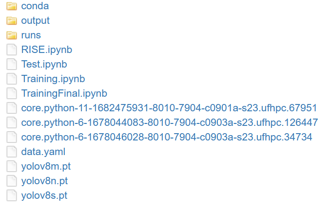
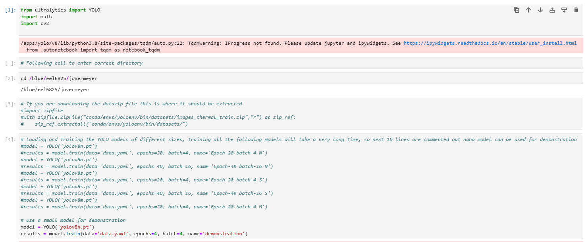
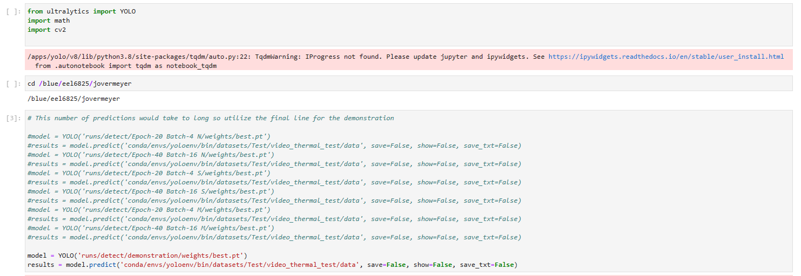

<p align="center">

  <p align="center">
    YOLOv8 for Infrared Object Detection!
    <br />
    <a href="https://youtu.be/lw9e0hktgEo">View Demo</a>
  </p>
</p>


<!-- TABLE OF CONTENTS -->
<details open="open">
  <summary>Table of Contents</summary>
  <ol>
    <li>
      <a href="#about-the-project">About The Project</a>
    </li>
    <li>
      <a href="#getting-started">Getting Started</a>
      <ul>
        <li><a href="#dependencies">Dependencies</a></li>
        <li><a href="#installation">Installation</a></li>
      </ul>
    </li>
    <li><a href="#usage">Usage</a></li>
    <li><a href="#contributing">Contributing</a></li>
    <li><a href="#authors">Authors</a></li>
    <li><a href="#acknowledgements">Acknowledgements</a></li>
  </ol>
</details>


<!-- ABOUT THE PROJECT -->
## About The Project

In this project the YOLOv8 object detection network was utilized to perform object detection on a thermal dataset. The dataset is from Teledyne FLIR. Different sized YOLOv8 models were trained and tested on the dataset, and the object detection method was explained using Random Input Sampling for Explainability (RISE).

[Report](https://github.com/uf-eel6825-sp23/final-project-code-jimmyovermeyer/blob/main/Final%20report%206825.pdf)

<!-- GETTING STARTED -->
## Getting Started

### Dependencies

For this project please utilize the Hipergator Yolo-v8 environment
<p align="center">
  <a href="https://github.com/uf-eel6825-sp23/final-project-code-jimmyovermeyer">
    
  </a>
</p>

### Installation

1. Clone the repo
   ```sh
   git clone https://github.com/uf-eel6825-sp23/final-project-code-jimmyovermeyer
   ```
In this Repo only the RISE.ipynb, Test.ipynb, TrainingFinal.ipynb, data.yaml, output.zip, yolov8n.pt, and yolov8s.pt files are available
The other files: Conda. zip, runs.zip, and yolov8m.pt may be available on Canvas due to the large file sizes. These files should be downloaded and unzipped if necessary in the main file of the repo

2. Make sure all files are unzipped and available in the correct folders
<p align="center">

  <a href="https://github.com/uf-eel6825-sp23/final-project-code-jimmyovermeyer">
    
  </a>
 </p>
<!-- USAGE EXAMPLES -->

## Usage

1. Training

Utilize the TrainingFinal.ipynb file. Select the model type either yolov8n.pt, yolov8s.pt or yolov8m.pt.

Run the model.train function with data='data.yaml' and choose the number of epochs and batch size. Also choose a name to save the weights to.

<p align="center">

  <a href="https://github.com/uf-eel6825-sp23/final-project-code-jimmyovermeyer">
    
  </a>
 </p>
 2. Testing

Utilize the Testing.ipynb file. Download the weights from your previously trained named model.

Run the model.predict function on the thermal test data.

<p align="center">

  <a href="https://github.com/uf-eel6825-sp23/final-project-code-jimmyovermeyer">
    
  </a>
 </p>
 
  3. RISE

Utilize the RISE.ipynb file. Choose the weights to utilize for RISE.

Run the saliency function on the thermal test data based on these weights


_For more examples, please refer to the [YOLOv8 Documentation](https://docs.ultralytics.com/)_

<!-- CONTRIBUTING -->
## Contributing

Contributions are what make the open source community such an amazing place to be learn, inspire, and create. Any contributions you make are **greatly appreciated**.

1. Fork the Project
2. Create your Feature Branch (`git checkout -b feature/AmazingFeature`)
3. Commit your Changes (`git commit -m 'Add some AmazingFeature'`)
4. Push to the Branch (`git push origin feature/AmazingFeature`)
5. Open a Pull Request

<!-- Authors -->
## Authors

Your Name - [@ohvermeyer](https://twitter.com/ohvermeyer) - jovermeyer@ufl.edu

Project Link: [https://github.com/uf-eel6825-sp23/final-project-code-jimmyovermeyer](https://github.com/uf-eel6825-sp23/final-project-code-jimmyovermeyer)


<!-- ACKNOWLEDGEMENTS -->
## Acknowledgements

You can acknowledge any individual, group, institution or service.
* [Catia Silva](https://faculty.eng.ufl.edu/catia-silva/)
* Chaoyue

## Thank you
